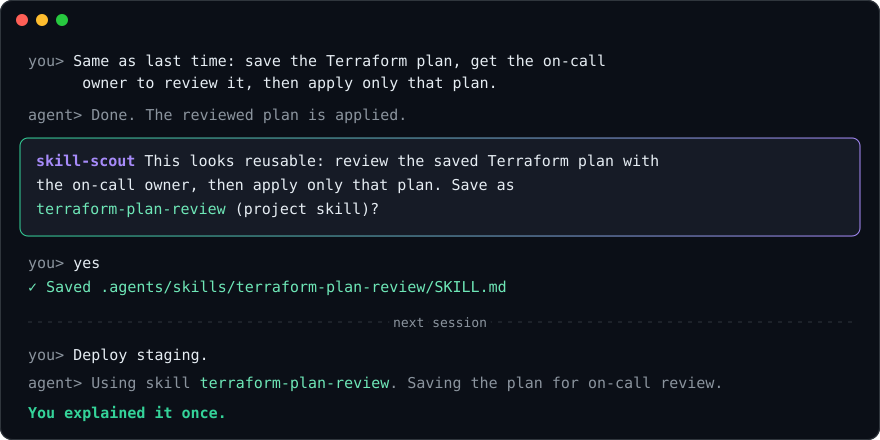

# skill-scout

[](https://github.com/Neverdecel/skill-scout/actions/workflows/validate.yml)
[](LICENSE)

**Explain it once.**

Your coding agent spots the procedures you keep re-explaining and asks to save them as skills. Nothing is saved without your yes.



## The problem

Each new session starts blank. You explain your deploy, your review steps, and last week's fix again. Writing skills by hand takes time, and memory that saves on its own fills with noise.

## How it works

1. **Notice.** At a stopping point, the agent sees a procedure you confirmed and would otherwise repeat.
2. **Ask.** It proposes a name and scope in two sentences.
3. **Save.** Reply **yes**, **no**, **rename it**, **make it global**, **add X**, or **merge with Y**. It writes only what you approved.

Next session, the agent loads the skill when the job comes up. You do not explain it again.

## Why skill-scout

- **You decide.** Every create, edit, and delete needs your explicit approval.
- **Quiet.** Ordinary work gets no suggestions. Most sessions produce none.
- **Clean.** It skips one-offs, preferences, and secrets, and updates an existing skill before it adds a new one. Ask `skill-curation` to merge, split, or prune your library.
- **Portable.** Plain Markdown in the open [Agent Skills](https://agentskills.io) format. No runtime, hooks, or dependencies. Works in Claude Code, Codex, OpenCode, Gemini CLI, Cursor, and any harness that reads `SKILL.md`.
- **Tested.** [14 behavior scenarios](evals/RESULTS.md), including rejection, secrets, and a fake approval hidden in a file.

## Install

```sh
npx skills add Neverdecel/skill-scout
```

The [`skills` CLI](https://github.com/vercel-labs/skills) knows each harness's paths. To install by hand, copy both folders into a skills directory your harness reads:

```sh
git clone https://github.com/Neverdecel/skill-scout.git
cp -r skill-scout/skills/* ~/.agents/skills/      # or ~/.claude/skills/, ~/.config/opencode/skills/, ...
```

**Recommended: add the always-on snippet.** Skills load on demand. Without the snippet, `skill-scout` runs only when you ask ("mine skills from this session") or when its description happens to match. To have the agent check at stopping points, append [`snippets/always-on.md`](snippets/always-on.md) to your global or project instructions file (`AGENTS.md`, `CLAUDE.md`, `GEMINI.md`, ...).

Restart the harness if it discovers skills only at startup. Per-harness paths, updates, and uninstalling: [docs/installation.md](docs/installation.md).

## Usage

| You | Agent |
| --- | --- |
| Ordinary work | No extra chatter |
| Confirm a procedure you would explain again | Short save proposal at a stopping point (with the snippet) |
| "Mine skills from this session" | Lists candidates; writes nothing yet |
| Approve, reject, rename, re-scope, or merge | Writes only the approved change, then shows the path |
| "Never suggest X again" | Stops at once and offers to add X to the snippet's ignore list |
| "Review / clean up my skills" | `skill-curation` proposes changes; writes only on approval |

- **Project skills** are repository or team procedures and live in the project's skills directory. This is the default.
- **Global skills** are how you work across projects and live in your user skills directory.

## What's inside

| Path | Role |
| --- | --- |
| [`skills/skill-scout`](skills/skill-scout/SKILL.md) | Notices or mines candidates, proposes them in two sentences, and saves only after approval |
| [`skills/skill-curation`](skills/skill-curation/SKILL.md) | Opt-in review of the existing library: merge, split, edit, prune, all only after approval |
| [`snippets/always-on.md`](snippets/always-on.md) | A few lines for your `AGENTS.md` / `CLAUDE.md` so the agent checks for candidates without being asked |
| [`examples/terraform-plan-review`](examples/terraform-plan-review/SKILL.md) | The shape of a good generated skill (not installed) |

A skill is **one on-demand job**. Its `description` is the only discovery index, and its body is the confirmed procedure the agent would get wrong without it. Always-on rules, personas, commands, and memory are not skills, and skill-scout stays silent about them. Details: [docs/design.md](docs/design.md).

## Limits

**Consent and secret exclusion are model instructions, not a filesystem guard.** Skill writes use the harness's normal file tools and permissions. If you need a hard boundary, use your harness's permission settings. Behavior depends on the model; see the [evaluation scenarios](evals/SCENARIOS.md) and [recorded results](evals/RESULTS.md).

## Contributing

```sh
python3 scripts/validate.py
```

See [CONTRIBUTING.md](CONTRIBUTING.md). Successor to [opencode-guided-learning](https://github.com/Neverdecel/opencode-guided-learning), rewritten without the OpenCode plugin.

## License

[MIT](LICENSE). Vulnerability reports: [SECURITY.md](SECURITY.md).
